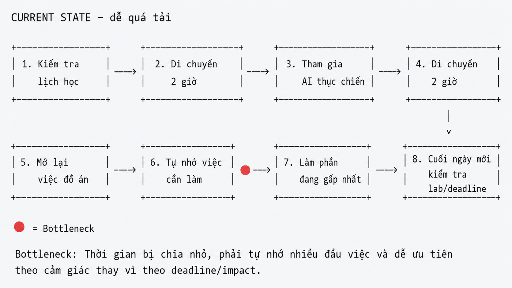

# 01 - Individual Problem Scan

## 0. Giới thiệu bối cảnh cá nhân

Tên tôi là **Đức**. Hiện tại tôi là sinh viên năm cuối của một trường đại học ở khu vực **Cầu Giấy** và cũng đang sinh sống tại đây. Ở thời điểm hiện tại, tôi đang chuẩn bị **bảo vệ đồ án tốt nghiệp**, đồng thời tham gia chương trình **AI thực chiến**.

Hoàn cảnh hiện tại tạo ra một số áp lực khá rõ: tôi phải phân bổ thời gian giữa đồ án tốt nghiệp và chương trình học mới; hằng ngày phải di chuyển khoảng **70 km cả đi và về**, tương đương khoảng **4 giờ di chuyển mỗi ngày** để tham gia chương trình; bên cạnh đó, nền tảng chuyên ngành của tôi thiên về **vi mạch, điện tử**, nên khi tiếp cận các nội dung AI thực chiến, tôi còn có một số khoảng trống kiến thức cần bù đắp. Ngoài ra, các thông báo của chương trình đôi khi chưa thật sự tập trung, xuất hiện ở nhiều kênh khác nhau nên cần kiểm tra liên tục.

Từ bối cảnh trên, tôi thực hiện phần problem scan để tìm ra các vấn đề thật, có actor rõ, có workflow hiện tại và có thể đo được impact.

---

## 1. Bảng scan vấn đề cá nhân

| # | Lăng kính | Problem quan sát được | Ai đang đau? | Dấu hiệu thật / Evidence |
|---|---|---|---|---|
| 1 | Tốn thời gian / Lặp lại | Mỗi ngày phải di chuyển khoảng 70 km cả đi và về để tham gia AI thực chiến, mất khoảng 4 giờ/ngày. | Người học tham gia chương trình trực tiếp nhưng ở xa địa điểm học | Thời gian di chuyển lặp lại hằng ngày, làm giảm thời gian dành cho đồ án, nghỉ ngơi và tự học sau buổi học. |
| 2 | Quá tải lịch trình | Cần phân bổ thời gian giữa việc chuẩn bị bảo vệ đồ án tốt nghiệp và hoàn thành các hoạt động trong chương trình AI thực chiến. | Sinh viên năm cuối vừa làm đồ án vừa tham gia chương trình học ngoài | Có nhiều việc song song: chỉnh sửa báo cáo, chuẩn bị slide, luyện bảo vệ, tham gia buổi học, làm lab và hoạt động nhóm. |
| 3 | Khoảng cách nền tảng kiến thức | Là sinh viên ngành thiên về vi mạch, điện tử nên khi học AI thực chiến có một số phần bị hổng kiến thức so với người có nền tảng AI/phần mềm. | Người học trái ngành hoặc chưa có nền tảng AI vững | Khi gặp các khái niệm như model, workflow, agent, embedding, evaluation, product metric, cần nhiều thời gian hơn để hiểu và liên hệ với bài lab. |
| 4 | Thông tin phân tán | Các thông báo của chương trình chưa tập trung ở một nơi rõ ràng, có nhiều kênh cần kiểm tra liên tục. | Học viên trong chương trình AI thực chiến | Phải kiểm tra nhiều nguồn như group chat, email, LMS/tài liệu, thông báo từ mentor hoặc bạn học để tránh bỏ sót deadline hay yêu cầu nộp bài. |
| 5 | Tốn năng lượng / Giảm hiệu suất | Sau thời gian di chuyển dài, khả năng tập trung để học thêm, đọc tài liệu hoặc làm lab vào buổi tối bị giảm. | Sinh viên phải học cả ngày và di chuyển nhiều | Có những ngày về muộn, cơ thể mệt, nhưng vẫn cần hoàn thành bài tập, đọc worksheet hoặc chuẩn bị nội dung cho đồ án. |
| 6 | Lặp lại / Dễ sót việc | Các việc cần làm cho đồ án và chương trình AI thực chiến nằm rải rác ở nhiều nơi, dễ quên hoặc ưu tiên sai. | Người phải quản lý nhiều đầu việc cùng lúc | Việc cần làm xuất hiện trong ghi chú cá nhân, tin nhắn nhóm, lịch học, file báo cáo và deadline lab; không có một danh sách ưu tiên thống nhất. |
| 7 | Khó chuyển đổi ngữ cảnh | Trong một ngày phải chuyển liên tục giữa tư duy kỹ thuật điện tử/vi mạch của đồ án và tư duy sản phẩm AI trong chương trình. | Sinh viên học/liên ngành giữa phần cứng và AI Product | Khi vừa sửa báo cáo đồ án xong lại chuyển sang bài lab AI Product, mất thời gian để bắt nhịp lại khái niệm, mục tiêu và cách trình bày. |
| 8 | Khó tham gia nhóm hiệu quả | Hoạt động nhóm trong chương trình AI thực chiến cần trao đổi nhanh, nhưng lịch cá nhân của mỗi thành viên khác nhau nên khó thống nhất ý tưởng và phân công. | Nhóm học viên làm lab AI Product | Mỗi người rảnh một khung giờ khác nhau, việc gom ý tưởng, chốt problem và thống nhất file nộp mất thêm thời gian. |
| 9 | Tài liệu học dày / Khó rút ý chính | Worksheet, README hoặc tài liệu lab có nhiều yêu cầu, nếu đọc nhanh dễ bỏ sót deliverable quan trọng. | Người học cần hoàn thành lab đúng rubric | Trước khi nộp thường phải đọc lại tài liệu nhiều lần để kiểm tra có đủ problem scan, workflow, metric, reflection và phần nhóm hay chưa. |
| 10 | Quản lý file và phiên bản | File đồ án, slide bảo vệ, bài lab, ghi chú và tài liệu nhóm có nhiều phiên bản khác nhau, dễ nhầm bản mới nhất. | Sinh viên năm cuối đồng thời làm nhiều loại tài liệu | Có thể có nhiều file như bản thảo báo cáo, slide, README lab, ghi chú nhóm; nếu không đặt tên và quản lý tốt dễ sửa nhầm file cũ. |

---

## 2. Chọn Top 3 problems

| Rank | Problem | Vì sao chọn | Điều còn chưa chắc |
|---|---|---|---|
| 1 | Phân bổ thời gian giữa đồ án tốt nghiệp và chương trình AI thực chiến | Đây là vấn đề ảnh hưởng trực tiếp hằng ngày, có actor rõ, có nhiều workflow liên quan và có thể đo bằng số giờ, số task hoàn thành, số deadline bị sát hạn. | Cần xác định phần nào nên giải quyết bằng process/checklist, phần nào có thể dùng AI để hỗ trợ lập kế hoạch. |
| 2 | Hổng kiến thức AI khi xuất phát từ ngành vi mạch, điện tử | Vấn đề sát với hoàn cảnh cá nhân, ảnh hưởng đến tốc độ học và khả năng hoàn thành lab. Có thể đo bằng thời gian hiểu tài liệu, số khái niệm chưa rõ, số lần phải hỏi lại. | Cần tránh biến giải pháp thành “AI tutor chung chung”; phải giới hạn vào việc giải thích theo ngữ cảnh lab. |
| 3 | Theo dõi thông báo chương trình từ nhiều kênh khác nhau | Đây là pain point lặp lại, ảnh hưởng đến nhiều học viên, có workflow hiện tại rõ và có thể đo bằng số kênh cần kiểm tra, thời gian kiểm tra, số thông báo bị bỏ sót. | Cần kiểm chứng xem thông báo thật sự phân tán đến mức nào và kênh nào là nguồn chính thức. |

---

# Problem Card #1

## Problem 1 câu

Sinh viên năm cuối đang chuẩn bị bảo vệ đồ án tốt nghiệp nhưng đồng thời tham gia chương trình AI thực chiến nên gặp khó khăn trong việc phân bổ thời gian học, làm lab, di chuyển và hoàn thiện đồ án.

## Actor

Sinh viên năm cuối vừa làm đồ án tốt nghiệp vừa tham gia chương trình học thực chiến bên ngoài trường.

## Thời điểm / bối cảnh

Trong giai đoạn gần bảo vệ đồ án, sinh viên vẫn cần tham gia các buổi học AI thực chiến, làm lab, làm việc nhóm và di chuyển hằng ngày. Với trường hợp của tôi, việc di chuyển khoảng 70 km cả đi và về làm mất khoảng 4 giờ mỗi ngày.

## Current workflow

1. Kiểm tra lịch học AI thực chiến trong ngày.
2. Di chuyển đến địa điểm học.
3. Tham gia buổi học hoặc hoạt động nhóm.
4. Di chuyển về.
5. Kiểm tra lại việc cần làm cho đồ án.
6. Làm tiếp báo cáo, slide hoặc phần chỉnh sửa đồ án.
7. Nếu còn thời gian thì đọc lại tài liệu/làm lab AI.
8. Cuối ngày mới tổng hợp lại việc còn thiếu.

## Bottleneck

Thời gian bị chia nhỏ và tiêu hao nhiều vào việc di chuyển. Sau buổi học, năng lượng giảm nên việc tiếp tục làm đồ án hoặc hoàn thiện lab không còn hiệu quả. Các việc quan trọng cũng dễ bị dồn sát deadline.

## Impact

- Mất khoảng 4 giờ/ngày cho di chuyển.
- Giảm thời gian tự học và chỉnh sửa đồ án.
- Dễ ưu tiên sai việc giữa đồ án và lab.
- Tăng áp lực khi deadline của đồ án và chương trình diễn ra cùng thời điểm.

## Success metric

- Giảm thời gian lập kế hoạch mỗi ngày xuống dưới 10 phút.
- Có danh sách 3–5 việc ưu tiên rõ ràng cho từng ngày.
- Giảm số task bị dồn sát deadline.
- Ít nhất 80% task quan trọng trong tuần được hoàn thành đúng hạn.

## Non-AI alternative

Dùng lịch cá nhân, checklist thủ công, time-blocking trên Google Calendar hoặc Notion/Todo app.

## AI hypothesis

AI có thể hỗ trợ gom các deadline, task đồ án, task lab và thời gian di chuyển thành một kế hoạch ngày/tuần. AI không làm thay công việc chính, nhưng có thể gợi ý thứ tự ưu tiên, nhắc việc bị trùng lịch và chia nhỏ task để dễ thực hiện hơn.

## Quick gut

- [ ] No AI / process fix
- [ ] Rule
- [x] Workflow
- [ ] Agent
- [ ] Chưa biết

## Draft workflow

### Current state

```text
CURRENT STATE — dễ quá tải



Bottleneck:
Thời gian bị chia nhỏ, phải tự nhớ nhiều đầu việc và dễ ưu tiên theo cảm giác thay vì theo deadline/impact.
```

### Future state

```text
FUTURE STATE — có kế hoạch rõ hơn

[Nhập deadline đồ án + deadline lab + lịch học + thời gian di chuyển]
→ [AI gom task và chia theo ngày]
→ [AI đề xuất 3–5 việc ưu tiên]
→ [Sinh viên chọn lại theo tình hình thật]
→ [Thực hiện theo time-block]
→ [Cuối ngày cập nhật trạng thái]
→ [AI gợi ý điều chỉnh kế hoạch ngày sau]

Human boundary:
AI không quyết định thay hoàn toàn lịch cá nhân. Sinh viên vẫn tự chọn việc ưu tiên cuối cùng dựa trên sức khỏe, deadline thật và yêu cầu của giảng viên/mentor.
```

---

# Problem Card #2

## Problem 1 câu

Sinh viên có nền tảng thiên về vi mạch, điện tử khi tham gia chương trình AI thực chiến dễ bị hổng một số khái niệm AI/Product, làm chậm tốc độ hiểu bài và hoàn thành lab.

## Actor

Người học trái ngành hoặc chưa có nền tảng AI/phần mềm vững, đặc biệt là sinh viên kỹ thuật điện tử, vi mạch, nhúng.

## Thời điểm / bối cảnh

Trong các buổi học hoặc khi làm lab AI Product, người học gặp các khái niệm như workflow, agent, evaluation, prompt, model, product metric, user pain point, validation. Một số khái niệm không quá khó nhưng nếu thiếu nền tảng sẽ mất thời gian để hiểu đúng và áp dụng vào bài làm.

## Current workflow

1. Đọc worksheet hoặc nghe giảng.
2. Gặp khái niệm AI/Product chưa rõ.
3. Tìm kiếm trên Google hoặc hỏi bạn/mentor.
4. Đọc nhiều nguồn khác nhau.
5. Cố gắng liên hệ lại với bài lab.
6. Áp dụng vào Problem Card hoặc workflow.
7. Nếu hiểu chưa đúng thì phải sửa lại bài.

## Bottleneck

Việc tra cứu kiến thức nền bị rời rạc, nhiều nguồn giải thích khác nhau và không phải nguồn nào cũng gắn trực tiếp với bài lab. Người học có thể hiểu khái niệm ở mức lý thuyết nhưng vẫn khó áp dụng vào output cụ thể.

## Impact

- Mất thêm thời gian để hiểu yêu cầu lab.
- Dễ viết problem quá chung chung.
- Dễ chọn Agent/AI solution quá sớm thay vì phân tích actor, workflow và bottleneck.
- Cần hỏi lại nhiều lần, làm chậm tiến độ cá nhân và nhóm.

## Success metric

- Giảm thời gian hiểu một khái niệm mới xuống dưới 10 phút.
- Mỗi khái niệm có ví dụ gắn với chính bài lab đang làm.
- Giảm số lần phải sửa vì hiểu sai yêu cầu.
- Người học có thể tự giải thích lại khái niệm bằng lời của mình.

## Non-AI alternative

Tạo glossary thủ công cho chương trình, ghi chú lại khái niệm sau mỗi buổi học, hỏi mentor hoặc học viên có kinh nghiệm.

## AI hypothesis

AI có thể đóng vai trò trợ lý giải thích khái niệm theo ngữ cảnh lab: giải thích ngắn, đưa ví dụ gần với ngành điện tử/nhúng, chỉ ra lỗi hiểu sai thường gặp và gợi ý cách áp dụng vào deliverable. AI không thay thế mentor mà chỉ hỗ trợ học viên tự học nhanh hơn.

## Quick gut

- [ ] No AI / process fix
- [ ] Rule
- [x] Workflow
- [ ] Agent
- [ ] Chưa biết

## Draft workflow

### Current state

```text
CURRENT STATE — học khái niệm rời rạc

[Đọc worksheet/nghe giảng]
→ [Gặp khái niệm chưa rõ]
→ [Tìm Google hoặc hỏi người khác]
→ [Đọc nhiều nguồn]
→ [Tự liên hệ với bài lab]
→ [Áp dụng vào bài]
→ [Có thể hiểu sai và phải sửa lại]

Bottleneck:
Kiến thức nền chưa đủ và nguồn giải thích chưa gắn với ngữ cảnh lab cụ thể.
```

### Future state

```text
FUTURE STATE — học theo ngữ cảnh

[Dán khái niệm hoặc đoạn worksheet chưa hiểu]
→ [AI giải thích ngắn gọn]
→ [AI đưa ví dụ liên hệ với điện tử/nhúng hoặc bài lab hiện tại]
→ [AI chỉ ra cách áp dụng vào output]
→ [Sinh viên tự viết lại bằng lời của mình]
→ [Kiểm tra lại với mentor/tài liệu chính thức nếu cần]

Human boundary:
AI không được xem là nguồn đúng tuyệt đối. Với khái niệm quan trọng hoặc yêu cầu chấm điểm, sinh viên vẫn cần đối chiếu lại với worksheet, mentor hoặc tài liệu chính thức.
```

---

# Problem Card #3

## Problem 1 câu

Học viên trong chương trình AI thực chiến phải theo dõi thông báo từ nhiều kênh khác nhau, khiến việc nắm deadline, yêu cầu nộp bài và lịch hoạt động mất thời gian và dễ bỏ sót.

## Actor

Học viên tham gia chương trình AI thực chiến, đặc biệt là người đang có lịch cá nhân dày hoặc vừa học vừa làm đồ án.

## Thời điểm / bối cảnh

Trong quá trình học, thông tin có thể xuất hiện ở nhiều nơi như group chat, email, LMS/tài liệu lab, thông báo từ mentor hoặc tin nhắn của nhóm. Người học phải kiểm tra nhiều lần trong ngày để biết có thay đổi deadline, yêu cầu nộp bài hay lịch hoạt động mới hay không.

## Current workflow

1. Mở group chat chung.
2. Kiểm tra tin nhắn ghim hoặc thông báo mới.
3. Kiểm tra email.
4. Kiểm tra tài liệu/README/lab worksheet.
5. Hỏi lại bạn học hoặc mentor nếu chưa chắc.
6. Ghi chú deadline hoặc yêu cầu nộp bài vào nơi riêng.
7. Lặp lại quá trình này nhiều lần trong ngày.

## Bottleneck

Thông tin phân tán ở nhiều kênh, không có một checklist hoặc timeline thống nhất. Người học mất thời gian kiểm tra thủ công và vẫn có thể bỏ sót thông báo quan trọng.

## Impact

- Tốn thời gian kiểm tra nhiều kênh mỗi ngày.
- Dễ bỏ sót deadline hoặc yêu cầu nộp bài.
- Có thể làm sai format hoặc thiếu deliverable.
- Tăng áp lực vì phải liên tục tự hỏi “mình đã đọc đủ thông báo chưa?”.

## Success metric

- Giảm số lần phải kiểm tra thủ công nhiều kênh trong ngày.
- Mỗi ngày có một danh sách thông báo quan trọng đã được gom lại.
- Giảm số thông báo/deadline bị bỏ sót.
- Người học biết rõ kênh nào là nguồn chính thức, kênh nào chỉ là trao đổi phụ.

## Non-AI alternative

Thống nhất một kênh thông báo chính thức, tạo lịch chung hoặc checklist deadline thủ công.

## AI hypothesis

AI có thể hỗ trợ tổng hợp thông báo từ các nguồn người học cung cấp, trích ra deadline, yêu cầu nộp bài, link quan trọng và các việc cần làm. AI cũng có thể tạo daily digest ngắn để người học kiểm tra nhanh. Tuy nhiên, AI không nên tự kết luận nếu nguồn thông tin mâu thuẫn.

## Quick gut

- [ ] No AI / process fix
- [x] Rule
- [x] Workflow
- [ ] Agent
- [ ] Chưa biết

## Draft workflow

### Current state

```text
CURRENT STATE — kiểm tra thủ công

[Mở group chat]
→ [Đọc tin nhắn mới]
→ [Kiểm tra email]
→ [Mở worksheet/README]
→ [Hỏi lại bạn hoặc mentor nếu chưa chắc]
→ [Ghi chú deadline thủ công]
→ [Lặp lại nhiều lần trong ngày]

Bottleneck:
Thông tin nằm rải rác, cần tự kiểm tra và tự tổng hợp.
```

### Future state

```text
FUTURE STATE — tổng hợp thông báo

[Người học cung cấp thông báo/tài liệu từ các kênh]
→ [AI trích xuất deadline, yêu cầu nộp bài, link quan trọng]
→ [AI tạo checklist/ngày]
→ [AI đánh dấu thông tin chưa rõ hoặc mâu thuẫn]
→ [Người học xác nhận lại với nguồn chính thức]
→ [Cập nhật lịch cá nhân]

Human boundary:
AI chỉ tổng hợp từ thông tin được cung cấp, không tự tạo deadline và không thay thế thông báo chính thức của chương trình.
```

---

## 3. Card muốn pitch nhất

Card tôi muốn pitch nhất:

```text
Problem Card #1: Phân bổ thời gian giữa đồ án tốt nghiệp và chương trình AI thực chiến.
```

## Vì sao chọn card này

Tôi chọn problem này vì đây là vấn đề ảnh hưởng trực tiếp nhất đến hoàn cảnh hiện tại của tôi. Việc chuẩn bị bảo vệ đồ án tốt nghiệp đã cần nhiều thời gian, trong khi chương trình AI thực chiến cũng yêu cầu tham gia học, làm lab, làm nhóm và tự học thêm. Đặc biệt, việc di chuyển khoảng 70 km cả đi và về mỗi ngày khiến quỹ thời gian thực tế bị giảm đáng kể.

Problem này có actor rõ, workflow hiện tại rõ và impact có thể đo được bằng số giờ di chuyển, số task hoàn thành, số deadline bị sát hạn hoặc số ngày bị quá tải. Bài toán cũng không bắt đầu từ AI solution ngay lập tức. Non-AI solution như checklist, calendar hoặc time-blocking có thể giúp một phần. Tuy nhiên, AI workflow có thể hỗ trợ tốt hơn ở việc gom task từ nhiều nguồn, ưu tiên theo deadline và chia nhỏ việc cần làm trong từng ngày.

## Câu hỏi muốn nhóm challenge

```text
1. Problem này có quá cá nhân không, hay nhiều sinh viên năm cuối cũng gặp tình trạng tương tự?
2. Vấn đề chính là thiếu thời gian, thiếu kế hoạch hay do thông tin/task bị phân tán?
3. Non-AI solution như Google Calendar/checklist đã đủ chưa?
4. AI nên hỗ trợ ở bước nào: gom task, ưu tiên deadline, chia nhỏ công việc hay nhắc việc?
5. Success metric nào hợp lý hơn: số giờ tiết kiệm được, số task hoàn thành hay số deadline không bị trễ?
6. Boundary cần đặt thế nào để AI không quyết định thay lịch cá nhân của người học?
```

---

## 4. Ghi chú về việc dùng AI

Tôi dùng AI để hỗ trợ hệ thống hóa các pain point từ hoàn cảnh cá nhân, gợi ý cách trình bày Problem Card và phản biện xem từng problem có đủ actor, workflow, bottleneck, impact và success metric hay chưa. Các vấn đề được chọn dựa trên trải nghiệm thực tế của bản thân trong giai đoạn vừa chuẩn bị bảo vệ đồ án tốt nghiệp, vừa tham gia chương trình AI thực chiến. Tôi không dùng AI để quyết định thay problem cuối cùng, mà dùng AI như một công cụ hỗ trợ sắp xếp và làm rõ ý tưởng.
